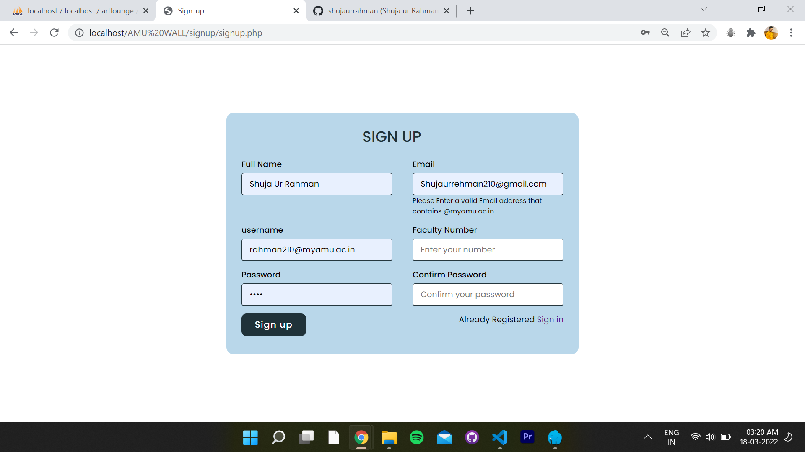

## 🟡AMU-WALL
AMU wall is a small login, sign up system with small Session Space where students with university registered email can signup and upload thier brief profile 
Which is displayed as cards hanging on the wall, that's how it got its name.
  

### How to run Locally?
⚡Steps:
- Clone the repository.
- Find Amu wall.sql file and import the sql to phpmyadmin
- Copy and paste folder in htdocs i.e Xampp or WWW in laragon or whaterver you use 
- Open your browser
- Copy and past: http://localhost/AMU WALL/index.php
- Now you are good to go 

### Languages and Tools:

 
-Frontend

   

-Behavior
  

-Backend and Data 
  
   

-Authentication

   

## Snaptshots

 

 

 

 

 

 

 

 

 

 

 

 

 

### Let's Connect :coffee:

	
	
	
	
  

 Developed by 
- Shuja ur Rahman  
 📫Reach me: **shujaurrehman210@gmail.com** 
 👨‍💻check out my portfolio at:[shuja-on-web](https://shujaurrahman.github.io/shuja-on-web/) 
 

